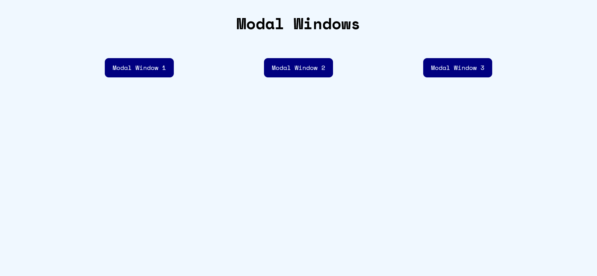

# Modal Windows

The page was created as part of the [Front End Developer Course by Orange DC](https://digitalcenter.orange.md/).

## Table of contents

- [Modal Windows](#modal-windows)
  - [Table of contents](#table-of-contents)
  - [Screenshot](#screenshot)
  - [Links](#links)
  - [Tasks](#tasks)
  - [Modal Windows Code Description](#modal-windows-code-description)
    - [Document Setup](#document-setup)
    - [Main Content](#main-content)
    - [Modal Window](#modal-window)
    - [Global Styles](#global-styles)
    - [Button Styling](#button-styling)
    - [Modal Styling](#modal-styling)
    - [Responsive Design](#responsive-design)
    - [JavaScript (Opening Modals)](#javascript-opening-modals)
    - [JavaScript (Closing Modals)](#javascript-closing-modals)
  - [Author](#author)

## Screenshot

## Links

[Modal Windows Page](https://axinitm.github.io/ODC-Modal-Window/)

## Tasks

Create a Modal Windows page.

## Modal Windows Code Description

This code implements a webpage with a title and a set of buttons that trigger modal pop-up windows when clicked. Each modal contains a title and a text paragraph, with functionality to close the modal either by clicking a close button or clicking outside of the modal area.

### Document Setup

The document is structured using HTML5 and sets the language to English (`lang="en"`). The `<meta>` tags ensure proper encoding (`UTF-8`) and responsiveness for mobile devices (`viewport`).

### Main Content

The page has a centered heading that reads "Modal Windows." Below the heading, there are three buttons, each with the text "Modal Window 1", "Modal Window 2", and "Modal Window 3". When clicked, they will trigger a modal window specific to the button.

### Modal Window

A hidden modal contains the window content, which includes:
- A close button positioned in the top right corner.
- A title and a description paragraph providing information within the modal.

### Global Styles

The `Space Mono` font is applied to the entire document using the Google Fonts API. Common CSS resets like removing margins, padding, and setting `box-sizing: border-box` are applied to ensure consistent appearance across browsers. Custom CSS variables (e.g., `--buttonColor`, `--bgColor`) define the colors for elements, making it easier to change the color scheme if needed.

### Button Styling

Buttons have a dark blue background and white text, with smooth hover animations. When hovered, buttons increase in size and change color to green. The buttons are arranged horizontally in a row, centered on the page.

### Modal Styling

The modal window is centered on the screen using flexbox and transforms. The window has a light blue background with dark blue text. An overlay with a semi-transparent dark background covers the entire screen when the modal is active, dimming the background for focus.

### Responsive Design

A media query ensures the layout is responsive. When the screen width is 470px or less:
- The heading becomes centered. 
- The buttons are stacked vertically with increased spacing.
- Hover effects are disabled to provide a better mobile experience.
- The modal window shrinks to fit smaller screens (80% width).

### JavaScript (Opening Modals)

Each button with the class `modalButton` opens the modal window when clicked. The text of the button is used to update the modal's title dynamically.

### JavaScript (Closing Modals)

The modal can be closed by clicking the close button (`&times;`), which hides the modal by adding the `hidden` class. Additionally, if the user clicks outside of the modal window (on the overlay), the modal also closes.

## Author

[Andrei Martinenko](https://github.com/AxinitM)
